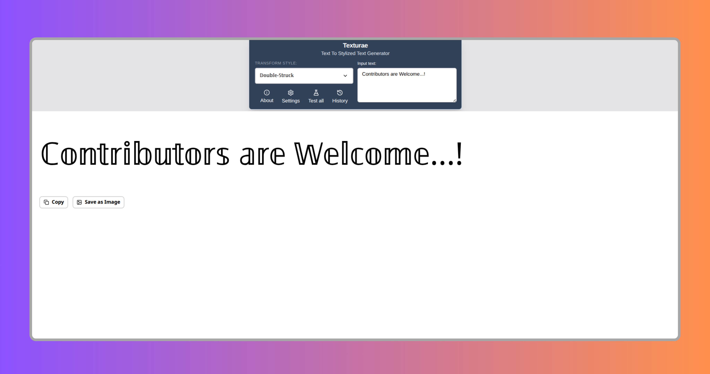

<p align="center">
  <a href="https://texturae.vercel.app/">
    
  </a>
</p>

<h1 align="center">Texturae</h1>

<p align="center">
  A modern, open-source text transformation studio for creating beautiful Unicode text, developer-friendly encoders, ciphers, and formatting tools, all in one fast, browser-based workspace.
</p>

<p align="center">
  
  
  
  
  
  
</p>

<p align="center">
  <a href="https://texturae.vercel.app/">Live Demo</a> •
  <a href="https://github.com/byllzz/texturae/issues/new">Report Bug</a> •
  <a href="https://github.com/byllzz/texturae/issues/new">Request Feature</a>
</p>


# About Texturae

Texturae is an open-source text transformation studio designed for creators, developers, students, and anyone who works with text every day. It brings dozens of text utilities into a single, responsive interface, making it easy to transform plain text into expressive Unicode styles, developer encodings, classic ciphers, and practical formatting tools without leaving the browser.

Unlike many online text generators that focus on only one category of transformations, Texturae combines multiple workflows into one cohesive experience. Whether you're styling a social media profile, converting text for development, experimenting with encoding formats, or exploring classic ciphers, every tool lives in the same consistent workspace with real-time previews and instant actions.

Everything runs entirely on the client. There are no external APIs, no server-side processing, and no tracking. Every transformation is handled locally through a deterministic transformation engine, ensuring fast performance, predictable output, and complete privacy.

# Features

Texturae brings together a wide collection of text transformation tools inside one unified workspace. Every feature is designed around instant feedback, minimal friction, and complete client-side processing, allowing you to focus on writing instead of switching between multiple websites.

| Category | Highlights |
|-----------|------------|
| **Live Transformation** | Real-time preview • Deterministic rendering • Instant style switching • Optimized performance |
| **Unicode Fonts** | Bold • Italic • Bubble • Gothic • Script • Small Caps • Fullwidth • Vaporwave • 90+ styles |
| **Developer Tools** | Base64 • URL Encode • Binary • Hex • ROT13 • Caesar • Morse • Character Codes |
| **Case Conversion** | camelCase • PascalCase • snake_case • kebab-case • CONSTANT_CASE • Title Case |
| **Text Utilities** | Reverse • Shuffle • Random Case • Remove Duplicates • Sort • Text Statistics |
| **Fun Styles** | Leetspeak • Pig Latin • Clap Text • Keyboard Shift • Decorative Effects |
| **Ciphers & Codes** | Atbash • ROT47 • Bacon Cipher • A1Z26 • Tap Code • Run-Length Encoding |
| **Test All Workspace** | Preview every transformation • Copy • Export • Apply instantly |
| **Image Export** | PNG Export • Preview • Watermark • Clipboard Support |
| **Native Sharing** | Web Share API • Clipboard fallback |
| **Personalization** | Themes • Font Size • Monospace • Auto Copy • Persistent Settings |
| **Privacy First** | Fully client-side • No tracking • No APIs • No server processing |

# Architecture

Texturae is built around a simple idea: every text transformation should be predictable, reusable, and completely independent from the user interface.

Instead of scattering transformation logic across components, the application centralizes every tool inside a dedicated transformation engine. The React interface simply passes the selected tool and input text to the engine, then renders the returned output. This separation keeps the codebase easy to understand, maintain, and extend as new transformations are added.

The entire application runs locally inside the browser, requiring no external APIs or server-side processing. Every conversion is deterministic, fast, and privacy-friendly.


## Adding a New Transformation

Expanding Texturae requires only two small steps.

### Step 1

Create a new transformation function inside:

```text
src/utils/toolMap.js
```

Each function should receive a string as input and return a transformed string without modifying external state.

```js
function exampleTransform(text) {
  return transformedText;
}
```

After creating the function, register it inside the shared `toolMap` object using a unique key.

### Step 2

Expose the new transformation by adding it to the appropriate category inside:

```text
src/data/tools.js
```

```js
{
  label: "Example Style",
  value: "exampleTransform"
}
```

The `value` must match the key registered inside the transformation engine.

Once these two steps are complete, the new transformation automatically becomes available throughout the application, including the editor, dropdown selector, Test All workspace, copy actions, exports, and every other interface that consumes the shared tool registry.

No additional configuration is required.

# Project Structure

The project follows a straightforward React structure where responsibilities are separated into reusable modules.

```text
texturae
├── public
├── src
│   ├── assets
│   ├── components
│   ├── data
│   ├── hooks
│   ├── layouts
│   ├── sections
│   ├── utils
│   ├── App.jsx
│   ├── main.jsx
│   └── global.css
├── package.json
└── vite.config.js
```

## Directory Overview

| Directory | Purpose |
|-----------|---------|
| `components/` | Reusable interface components including the editor, output area, dropdowns, export controls, preview components, and shared UI. |
| `layouts/` | Shared application layouts and workspace containers. |
| `sections/` | Full-page sections such as About, Settings, and the Test All workspace. |
| `utils/` | Transformation engine, helper functions, and rendering utilities. |
| `data/` | Transformation categories, tool definitions, and shared configuration. |
| `hooks/` | Custom React hooks for reusable application logic and persistent settings. |
| `assets/` | Images, icons, previews, banners, and other static assets. |

# Design Principles

Texturae is built around a small set of engineering principles that keep the codebase predictable, maintainable, and easy to extend.

| Principle | Description |
|-----------|-------------|
| **Deterministic Transformations** | Every transformation produces consistent output for identical input. |
| **Pure Functions** | Transformation logic remains isolated from application state and external services. |
| **Client-Side Processing** | All transformations run entirely within the browser without server-side processing. |
| **Reusable Components** | The interface is built from modular React components that encourage consistency and reuse. |
| **Data-Driven UI** | Tools and categories are generated from shared configuration instead of hardcoded interfaces. |
| **Extensible Architecture** | New transformations integrate with minimal code changes while automatically working across the application. |

# Performance

Texturae is designed to remain responsive even when rendering dozens of transformations simultaneously.

| Optimization | Benefit |
|--------------|---------|
| **Memoized Rendering** | Reduces unnecessary re-renders for a smoother experience. |
| **Shared Registry** | Fast transformation lookup across the application. |
| **Local Persistence** | Saves user preferences between sessions. |
| **Client-Side Processing** | Zero network requests during transformations. |
| **Optimized Rendering** | Smooth performance inside the Test All workspace. |

# Built With

Texturae is built with a modern frontend stack focused on performance, maintainability, and an excellent developer experience.

| Technology | Purpose |
|------------|---------|
| **React** | Component-based UI architecture |
| **Vite** | Fast development server and optimized production builds |
| **Tailwind CSS v4** | Utility-first styling framework |
| **JavaScript (ES6+)** | Application logic and transformation engine |
| **Lucide React** | Modern icon library |
| **React Icons** | Additional icon collections |
| **html-to-image** | Export transformed text as PNG images |

<p align="left">
  
</p>

# Getting Started

Running Texturae locally only takes a few minutes.

## Prerequisites

Before getting started, make sure you have the following installed:

- Node.js (latest LTS recommended)
- npm or Yarn
- A modern web browser such as Chrome, Edge, Firefox, or Safari

## Installation

Clone the repository.

```bash
git clone https://github.com/byllzz/texturae.git
```

Move into the project directory.

```bash
cd texturae
```

Install all project dependencies.

```bash
npm install
```

Start the development server.

```bash
npm run dev
```

Once the development server is running, open your browser and navigate to the local address displayed in the terminal.

## Production Build

Generate an optimized production build using:

```bash
npm run build
```

To preview the production build locally:

```bash
npm run preview
```

# Contributing

Contributions of every size are welcome.

Whether you're fixing a typo, improving accessibility, adding a new transformation, optimizing performance, or introducing an entirely new feature, every contribution helps make Texturae better.

Before opening a pull request, please take a moment to understand how the transformation engine is organized. Most new features only require a small amount of code thanks to the project's modular architecture.

## Adding a New Transformation

Creating a new text transformation is intentionally straightforward.

### 1. Create the transformation

Add a new pure function inside:

```text
src/utils/toolMap.js
```

Register it using a unique key inside the shared `toolMap` object.

### 2. Register the tool

Open:

```text
src/data/tools.js
```

Add a new entry to the appropriate category.

```js
{
  label: "Example Tool",
  value: "exampleTool"
}
```

The `value` must match the key used inside the transformation engine.

Once registered, the tool automatically becomes available throughout the application.


# Author


## Bilal Malik

[](https://github.com/byllzz)
[](https://x.com/bilalmlkdev)
[](https://bilalmlkdev.vercel.app)
[](https://www.linkedin.com/in/bilalmlkdev/)
[](mailto:bilalmlkdev@gmail.com)

If you enjoyed this project, consider giving it a ⭐ on GitHub. It helps others discover the project and motivates future improvements.

<p align="right">
  <a href="#texturae">⬆ Back to Top</a>
</p>

# License (MIT)


This project is licensed under the **MIT License**.


```text

MIT License

Copyright (c) 2026 Bilal Malik

Permission is hereby granted, free of charge, to any person obtaining a copy
of this software and associated documentation files (the "Software"), to deal
in the Software without restriction, including without limitation the rights
to use, copy, modify, merge, publish, distribute, sublicense, and/or sell copies
of the Software.The above copyright notice and this permission notice shall
be included in all copies or substantial portions of the Software.

THE SOFTWARE IS PROVIDED "AS IS", WITHOUT WARRANTY OF ANY KIND, EXPRESS OR
IMPLIED, INCLUDING BUT NOT LIMITED TO THE WARRANTIES OF MERCHANTABILITY,
FITNESS FOR A PARTICULAR PURPOSE AND NONINFRINGEMENT. IN NO EVENT SHALL THE
AUTHORS OR COPYRIGHT HOLDERS BE LIABLE FOR ANY CLAIM, DAMAGES OR OTHER
LIABILITY, WHETHER IN AN ACTION OF CONTRACT, TORT OR OTHERWISE, ARISING FROM
OUT OF OR IN CONNECTION WITH THE SOFTWARE OR THE USE OR OTHER DEALINGS IN THE
SOFTWARE.

```

© 2026 texturae. Licensed under the MIT License.
